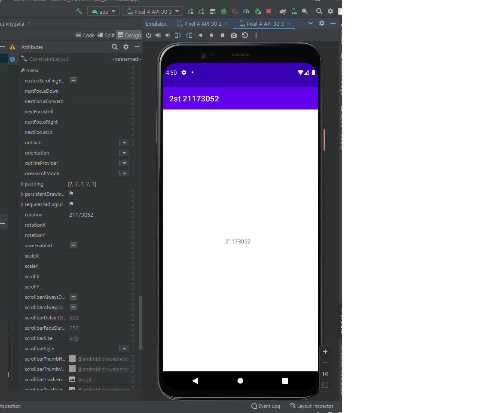
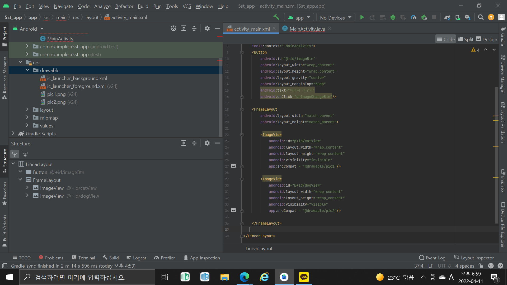
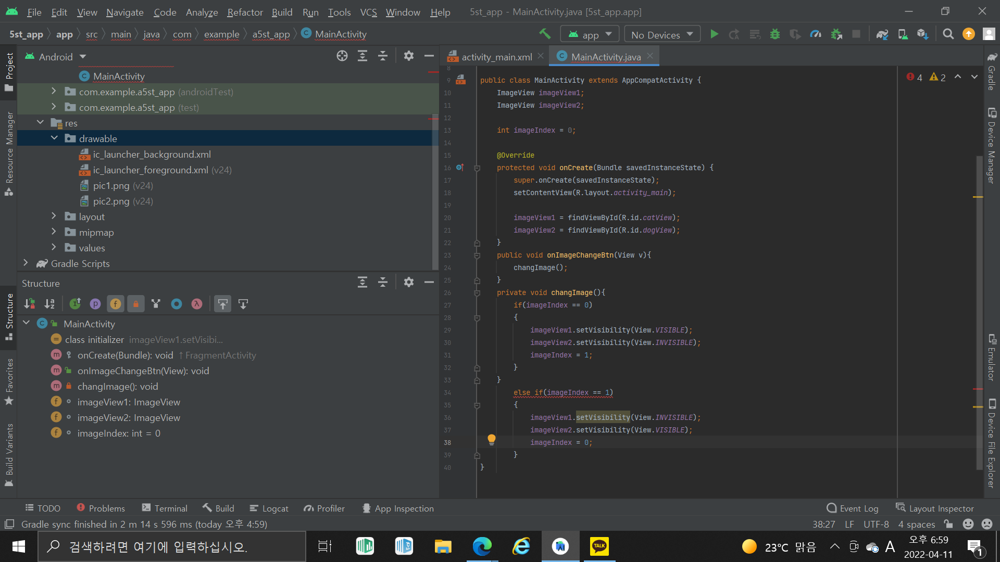
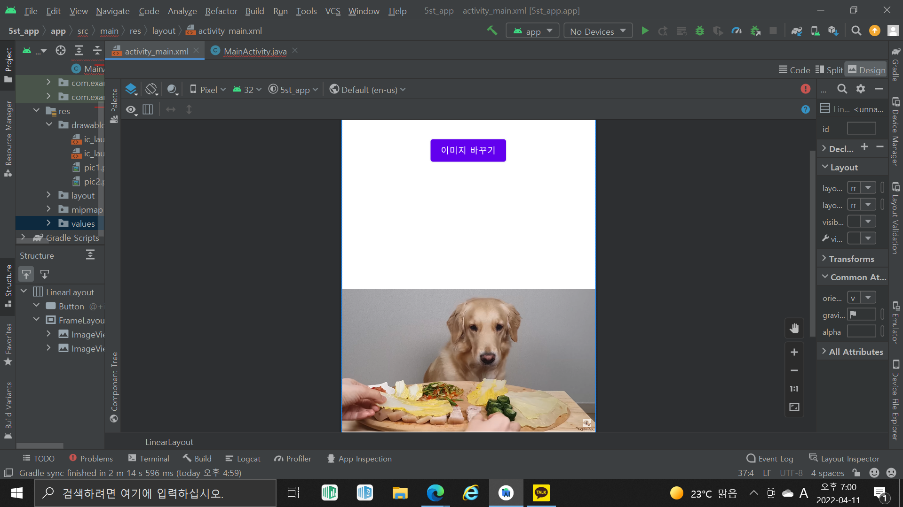
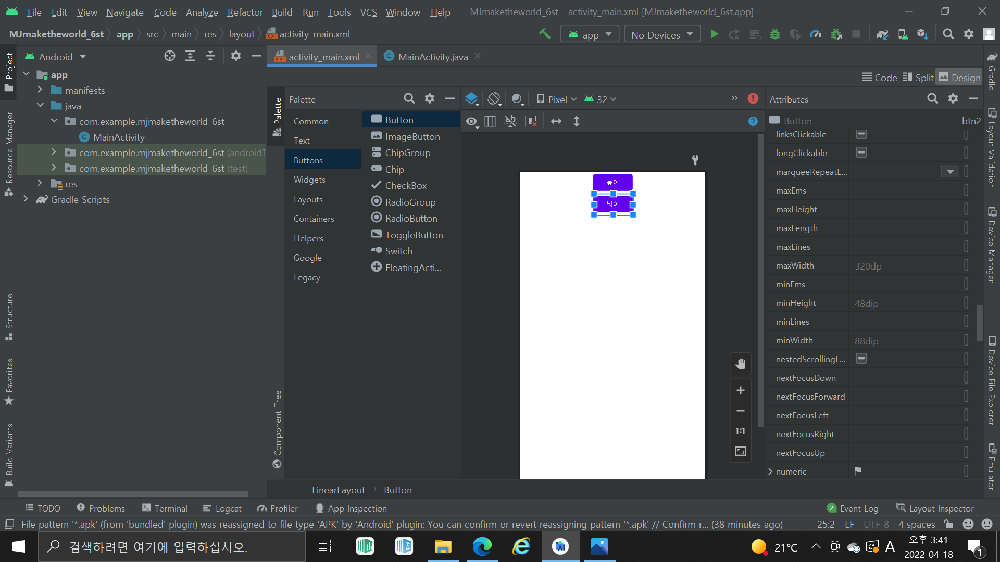
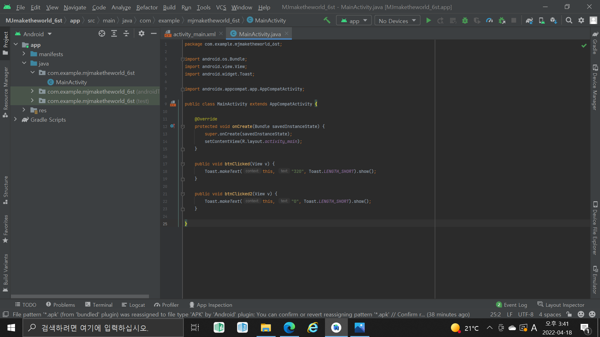
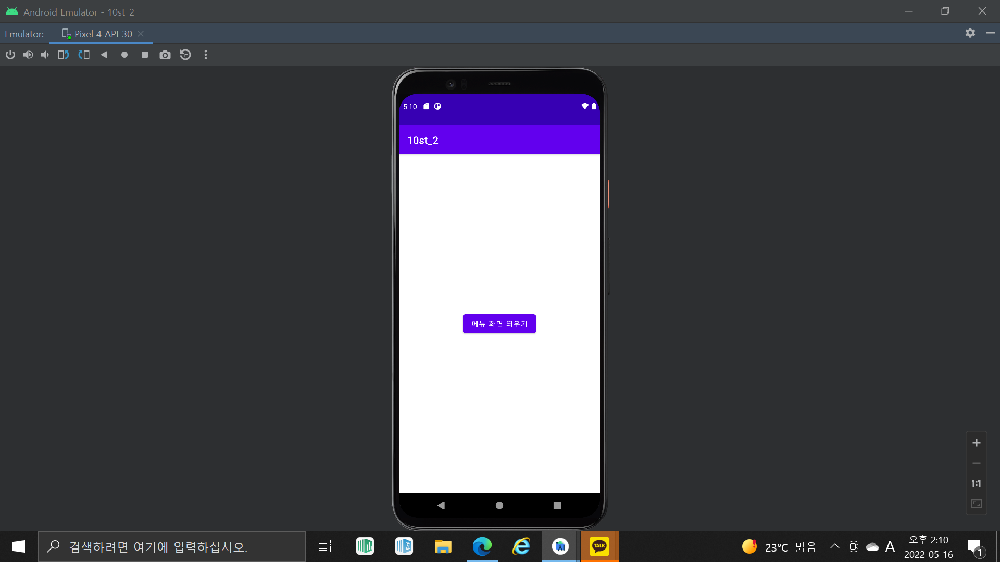
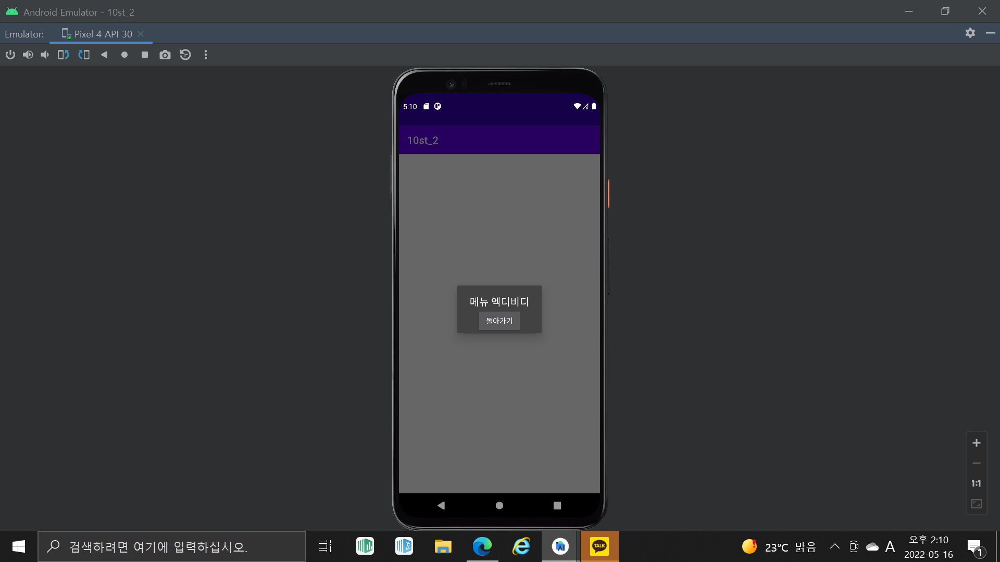

# 2주차 (2022-03-15)
 - 안드로이드 스튜디오 설치 , 깃허브 가입 및 저장소 생성
</img>

## 3주차 과제 (2022-03-22)
</img>
</img>
</img>

## 5주차 과제 (2022-03-30)
</img>
</img>
</img>

## 6주차 과제 (2022-04-13)
</img>
</img>

## 10주차 과제 (2022-05-04)
</img>
</img>
</img>
</img>

